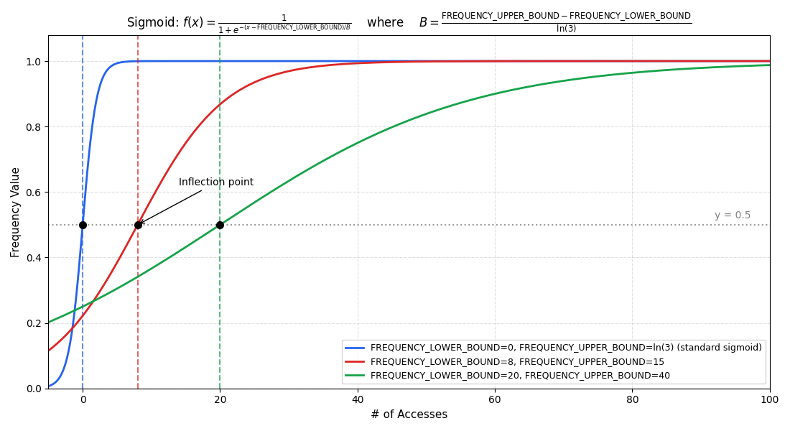
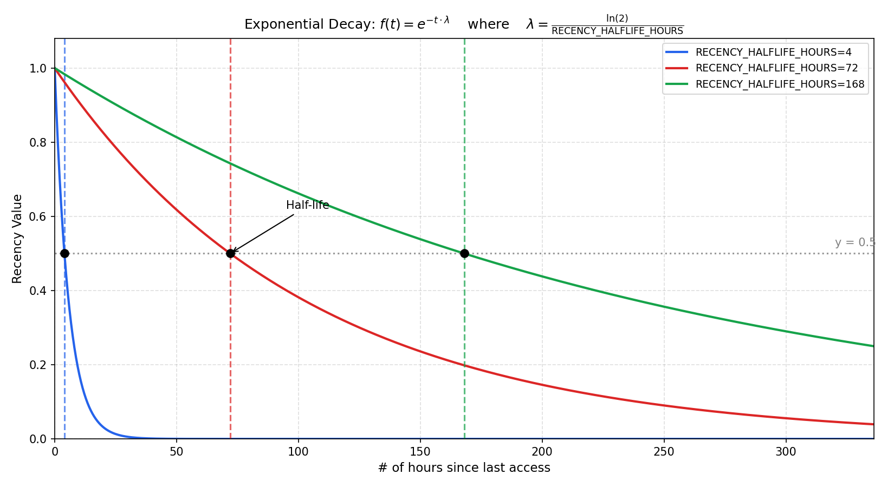
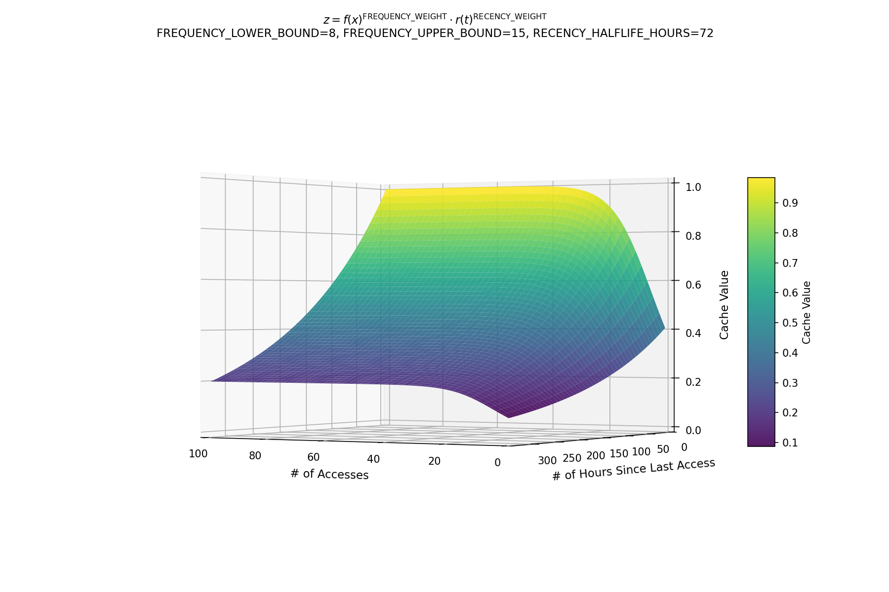

# crasher - The Ranger Cacher

A caching system based on frequency and recency for ranger file manager that prioritizes paths you use frequently and recently.

## Overview

The system scores paths using two factors:
- **Frequency**: How many times you've accessed the path
- **Recency**: How recently you accessed it

The data store containing the cache is pruned with each access to keep it both under capacity and to evict those entries that fall below a configurable threshold..

## Installation

> [!NOTE]
> Be sure the following dependencies are installed first before proceeding:
> - `ranger`:
>   - https://github.com/ranger/ranger
> - `fd`:
>   - https://github.com/sharkdp/fd
> - `fzf`:
>   - https://github.com/junegunn/fzf

1. Clone this repo and enter it

```bash
git clone https://github.com/Quin-Darcy/crasher.git && cd crasher
```

2. Copy the contents of the repo into your ranger config folder.

```bash
cp commands.py search_strategy.py caching ~/.config/ranger/
```

3. Restart ranger

## Usage

In ranger, use:

```
:fd_directory_search <term> [hint]  # Search directories
:ff_file_search <term> [hint]       # Search files
:cache_cleanup                      # Remove stale entries
```

Add keybindings to `rc.conf`:

```
map fd console fd_directory_search%space
map ff console ff_file_search%space
```

## Configuration

Edit `caching/config.py` to adjust:

| Setting | Default | Description |
|---------|---------|-------------|
| `FREQUENCY_WEIGHT` | 0.6 | Weight given to access count |
| `RECENCY_WEIGHT` | 0.5 | Weight given to recent access |
| `INITIAL_CACHE_SCORE` | 0.5 | The initial score given to new paths |
| `RECENCY_HALFLIFE_HOURS` | 72 | Hours until recency score halves |
| `FREQUENCY_LOWER_BOUND` | 8 | Number of times a path is accessed, below which the score is 0.5 or less |
| `FREQUENCY_UPPER_BOUND` | 15 | Number of times a path is accessed, above which the score is 0.75 or more |
| `MAX_CACHE_ENTRIES` | 70 | Maximum paths to track |
| `FALLBACKS` | | List of paths to check if no match is found in cache |
| `EVICTION_THRESHOLD` | 0.25 | Minimum cache value before entry is evicted from data store |

## How Scoring Works

### Frequency Component



Uses a sigmoid function centered around `FREQUENCY_LOWER_BOUND` (default: 8 accesses). This means that if a file path is accessed 8 times, it's frequency value is assigned 0.5. Thus, 8 would be the *inflection point* of the sigmoid.

The `FREQUENCY_UPPER_BOUND` (default: 15 access) parameter determines the *growth rate* of the sigmoid. This parameter defines how many accesses a path much receive before its frequency value hits 0.75. The parameter essentailly control how steep the sigmoid is.

With the default parameters, these are the frequency value assignments. 

- 1 access: ~0.25
- 5 accesses: ~0.38
- 10 accesses: ~0.57
- 50+ accesses: ~1.00

### Recency Component



Uses exponential decay with configurable half-life. The `RECENCY_HALFLIFE_HOURS` defines how many hours with no accesses until a given path's recency value is cut in half. 

The current default given the following recency value assignments.

- Just accessed: 1.00
- At half-life (72h default): 0.50
- 1 week ago: ~0.20
- 1 month ago: ~0.10

### Combined Score



The "cache value" of a given path is computed as the combined score of its recency value and frequency value. The parameters `FREQUENCY_WEIGHT` and `RECENCY_WEIGHT` determine how important frequency and recency is, respectively. The cache value is defined as a log-linear combination which means we raise the frequency and recency values to their respective weights and multiply. 

Higher weights means the terms express more quickly. For example, as you increase `RECENCY_WEIGHT`, then the longer its been since a file has been accessed has a greater impact on the overall cache value and it will decay faster.

Combining the score allows for a balancing to take place. For example, if there was a folder you visited very actively 1 year ago then it would have a very high frequency value. However, it's recency value would be practically zero and so it's overall cache value would not be execessivly high due to past activity.

```
score = (frequency_value) ^ (FREQUENCY_WEIGHT) × (recency_value) ^ (RECENCY_WEIGHT)
```

Scores are recalculated at query time to account for time passing since last access.

### Choosing an Eviction Threshold

The `EVICTION_THRESHOLD` determines which entries get purgeds from the cache. The entries with a cache value lower than the threshold are evicted. The table below shows the cache values for various access counds and ages using the default parameters.

**Default Parameters**:
- `FREQUENCY_WEIGHT=0.6` 
- `RECENCY_WEIGHT=0.5`
- `FREQUENCY_LOWER_BOUND=8`
- `FREQUENCY_UPPER_BOUND=15`
- `RECENCY_HALFLIFE_HOURS=72`

| Accesses | 1 hour | 1 day | 3 days | 1 week | 2 weeks |
|----------|--------|-------|--------|--------|---------|
| 1        | 0.43   | 0.39  | 0.31   | 0.19   | 0.09    |
| 5        | 0.56   | 0.50  | 0.40   | 0.25   | 0.11    |
| 10       | 0.72   | 0.64  | 0.51   | 0.32   | 0.14    |
| 25       | 0.96   | 0.86  | 0.68   | 0.43   | 0.19    |
| 50       | 0.99   | 0.89  | 0.71   | 0.45   | 0.20    |

**Reading the table**: Find the row matching how often you access apath and the column for how old it is. The cell value is the given cache score. Entries with scores below the threshold get evicted.

#### Example Thresholds

| Threshold | Effect |
|-----------|--------|
| 0.10 | Conservative. Keeps most entries. A path accessed 5 times survives 2 weeks. |
| 0.20 | Moderate. Single-access paths evicted within a week; heavily used paths survive ~2 weeks. |
| 0.35 | Aggressive. Single-access paths evicted within days. Keeps only frequently used paths. |

### Testing Configurations

The `config_tester.py` script generates reference tables for any parameter combination which should help tune the cache behavior before commiting the changes.

#### Basic Usage

- Generate table with default parameters

```bash
python3 config_tester.py
```

- Output as markdown

```bash
python3 config_tester.py --markdown
```

- Testing an eviction threshold

```bash
pyton3 config_tester.py --threshold 0.25
```

**Output**:

```
Cache Value Reference Table
=================================================================
FREQUENCY_WEIGHT=0.6, RECENCY_WEIGHT=0.4
FREQUENCY_LOWER_BOUND=8, FREQUENCY_UPPER_BOUND=15
RECENCY_HALFLIFE_HOURS=72
EVICTION_THRESHOLD=0.25  (* = evicted)

Accesses      1 hour     1 day    3 days    1 week   2 weeks
------------------------------------------------------------
1               0.43      0.40      0.33     0.23*     0.12*
5               0.56      0.51      0.43      0.30     0.15*
10              0.72      0.66      0.55      0.38     0.20*
25              0.96      0.88      0.73      0.50      0.26
50              1.00      0.91      0.76      0.52      0.27
```

#### Custom Parameters

Overide any parameters to see its effect

- Faster decay (48-hour half-life instead of 72)

```bash
python3 config_tester.py --halflife 48 --threshold 0.20
```

- Combine multiple changes

```bash
python3 config_tester.py --halflife 48 --recency-weight 0.5 --lower-bound 5 --threshold 0.15
```

#### Available Options

| Option | Default | Description |
|--------|---------|-------------|
| `--frequency-weight` | 0.6 | Exponent for frequency component |
| `--recency-weight` | 0.5 | Exponent for recency component |
| `--lower-bound` | 8 | Sigmoid inflection point (accesses for 0.5 frequency score) |
| `--upper-bound` | 15 | Sigmoid steepness (accesses for 0.75 frequency score) |
| `--halflife` | 72 | Hours until recency score halves |
| `--threshold` | — | Eviction threshold to test (marks cells below with \*) |
| `--markdown` | — | Output as markdown table |

## Files

```
~/.config/ranger/
├── caching/
│   ├── __init__.py
│   ├── config.py       # All configuration
│   ├── cache_value.py  # Score calculations (pure functions)
│   ├── storage.py      # File I/O
│   ├── manager.py      # Main cache interface
├── commands.py         # Ranger commands
└── search_strategy.py  # Defines fallback searches
```

## Dependencies

- `fd` (fd-find): For filesystem searching
- `fzf`: For interactive selection

## Troubleshooting

**Paths not appearing in search:**
- Check if the path exists: `ls /path/to/check`
- Run `:cache_cleanup` to remove stale entries
- Access the path directly to add it to cache

**Scores seem wrong:**
- Check `config.py` settings match your usage patterns
